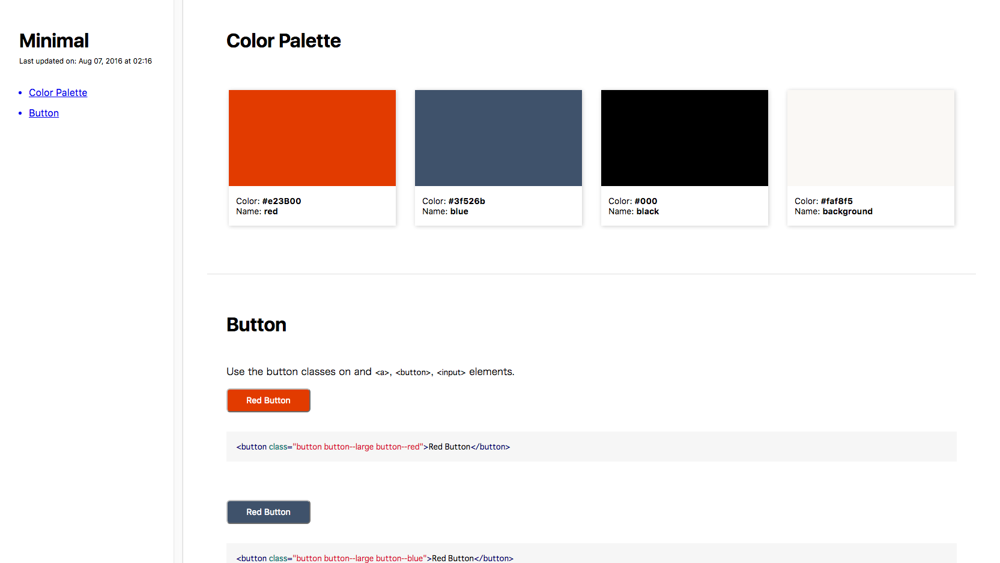

# psg-theme-minimal [](https://www.npmjs.com/package/psg-theme-minimal)

minimal theme of [postcss-style-guide](https://github.com/morishitter/postcss-style-guide)

## Install

```shell
$ npm install psg-theme-minimal
```

## Theme



## License

The MIT License (MIT)
